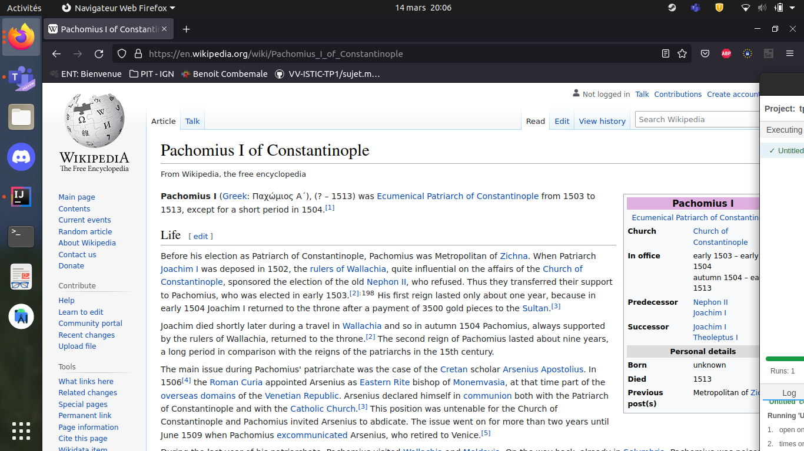

## Find a bug

Clone the [Simba Organizer repository](https://github.com/barais/doodlestudent/) and follow the instructions to run the application on your machine.

Find a bug in the application. 

With the help of Selenium and the Page Object Model desing pattern write a simple test that fails for this bug.

Optionally make a pull request to the project.

Include in this document the code of the test and, if you did it, the link to the pull request.

## Answer

Un bug intervient  assez tôt lors de la navigation dans l'application. Lorsqu'un utilisateur essaie de créer un sondage il lui est possible de naviguer vers les étapes suivantes sans remplir les champs en cliquant sur les liens. Un renforcement des vérifications serait le bienvenue. 

````java

public class TestFormPollCreation {

    private WebDriver webDriver;
    private String urlTovisit;

    @BeforeEach
    public void setUp(){
        urlTovisit = "http://localhost:4200/create";
        WebDriverManager.chromedriver().setup();
        webDriver = new ChromeDriver();
    }
    @AfterEach
    public void tearDown(){
        webDriver.quit();
    }

    @Test
    public void testBlockedNext(){
        webDriver.navigate().to(urlTovisit);
        WebElement button = webDriver.findElement(By.xpath("//span[contains(text(), '2')]"));
        button.click();
        //vérifier qu'au clic le titre de la section Choix de date ne passe pas en gras
        element = driver.findElement(By.xpath("//*[text()='Choix de la date'"));
        String fontWeight = elem.getCssValue("font-weight");
        assertFalse(fontWeight.equals("700")); 
        
    }
}

````