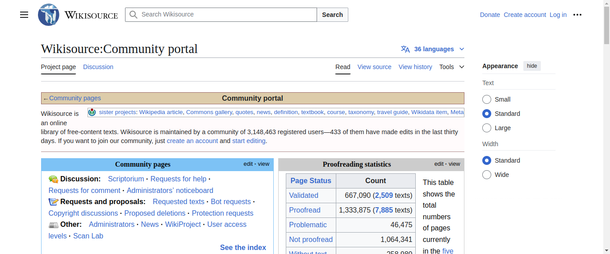

# Random Wikipedia walker

Using Selenium, create a small program that, starting from the main page https://www.wikipedia.org/, walks trough a sequence of random links and takes a snapshot of the last page.
The process is as follows:

 1. Navigate to the main page https://www.wikipedia.org/
 2. Select a random link in the page
 3. Navigate to the link
 4. Repeat steps 2 to 3 until you have visited 10 different pages
 5. Take a snapshot of the current page and save it

Include the code of the walker and the snapshot in this document.

## Answer

```python
from selenium import webdriver
from selenium.webdriver.common.by import By
from selenium.webdriver.common.action_chains import ActionChains
from selenium.webdriver.chrome.service import Service
from selenium.webdriver.chrome.options import Options
from selenium.common.exceptions import NoSuchElementException, WebDriverException
import random
import time

# Configure WebDriver options
chrome_options = Options()
#chrome_options.add_argument("--headless")  # Run browser in headless mode
#chrome_options.add_argument("--disable-gpu")
#chrome_options.add_argument("--window-size=1920,1080")

# Path to the ChromeDriver executable
service = Service("/snap/bin/chromium.chromedriver")

# Initialize the WebDriver
driver = webdriver.Chrome(service=service, options=chrome_options)

try:
    # Navigate to Wikipedia's main page
    driver.get("https://www.wikipedia.org/")
    visited_urls = set()

    # Loop through 10 random links
    for _ in range(10):
        time.sleep(0.5)  # Wait for the page to load
        links = driver.find_elements(By.TAG_NAME, "a")
        links = [link for link in links if link.get_attribute("href")]

        # Filter out already visited URLs and select a random link
        random_links = [link for link in links if link.get_attribute("href") not in visited_urls]
        if not random_links:
            print("No new links to visit. Exiting early.")
            break

        random_link = random.choice(random_links)
        url = random_link.get_attribute("href")
        visited_urls.add(url)

        # Navigate to the random link
        print(f"Visiting: {url}")
        try:
            random_link.click()
        except WebDriverException:
            driver.get(url)  # Fallback if the click action fails

    # Take a screenshot of the final page
    screenshot_path = "final_page_screenshot.png"
    driver.save_screenshot(screenshot_path)
    print(f"Screenshot saved at {screenshot_path}")

finally:
    # Close the WebDriver
    driver.quit()
```

