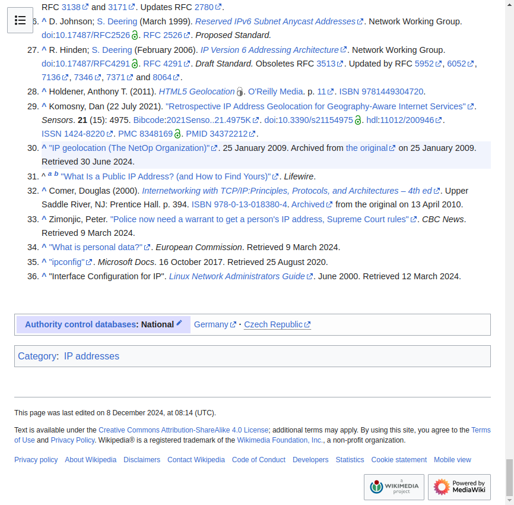

# Random Wikipedia walker

Using Selenium, create a small program that, starting from the main page https://www.wikipedia.org/, walks trough a sequence of random links and takes a snapshot of the last page.
The process is as follows:

 1. Navigate to the main page https://www.wikipedia.org/
 2. Select a random link in the page
 3. Navigate to the link
 4. Repeat steps 2 to 3 until you have visited 10 different pages
 5. Take a snapshot of the current page and save it

Include the code of the walker and the snapshot in this document.

## Answer




L'ensemble de code est [ici](../code/TP5-Selenium/src/main/java/tp5/vv/selenium/SeleniumWiki.java)

```Java
public static void main(String[] args) throws InterruptedException {

    ChromeOptions options = new ChromeOptions();
    //options.addArguments("--disable-notifications");

    WebDriver driver = new ChromeDriver(options);


    try {
        driver.get("https://fr.wikipedia.org/wiki/Wikip%C3%A9dia:Accueil_principal");

        int visitedPages = 0;

        while (visitedPages < 10) {
            List<WebElement> links = driver.findElements(By.tagName("a"));

            WebElement randomLink = null;

            int randomInt;
            Random rand = new Random();

            randomInt = rand.nextInt(links.size()-1);
            randomLink = links.get(randomInt);
            System.out.println(randomLink.getAttribute("href"));

            //attendre que ça sois cliquable
            /*
            WebDriverWait wait = new WebDriverWait(driver, Duration.ofSeconds(20));
            wait.until(ExpectedConditions.elementToBeClickable(randomLink));
            */

            // Cliquer sur le lien
            //randomLink.click(); //cliquable créer trop de contrainte, pour enchainer les pages
            driver.get(randomLink.getAttribute("href"));

            visitedPages++;

            //attendre l'ouverture de la nouvelle page
            Thread.sleep(3000);

            System.out.println("Page visitée : " + driver.getCurrentUrl());

            if(visitedPages==10){
                Snapshot(driver, "snapshot_WikiPage10.png");
            }
        }
    } catch (InterruptedException e) {
        e.printStackTrace();
    } finally {
        driver.quit();
    }
}

public static void Snapshot(WebDriver driver, String fileName) {

    TakesScreenshot screenshot = (TakesScreenshot) driver;
    File screenshotFile = screenshot.getScreenshotAs(OutputType.FILE);

    try {
        FileHandler.copy(screenshotFile, new File(fileName));
        System.out.println("Capture d'écran sauvegardée sous: " + fileName);
    } catch (IOException e) {
        System.out.println("Erreur lors de la sauvegarde de la capture d'écran.");
        e.printStackTrace();
    }
}
```